# azure-api-management-project

# Project: My Weather API

## Project Introduction

## Project Summary

You have been tasked to provide API management to a new weather API your company is developing! The API is fully functional, but you need a way to provide access to the API. Azure API Management has been chosen to provide this access. You have requirements from security that the API must be secured by authentication through subscription keys. Security would also like policies implemented to throttle API requests so malicious actors cannot overwhelm the API. Additionally, security would like certain headers deleted from API responses to mask the service even further. And finally - the API must have the ability to be monitored through metrics, logs and alerts.

## Peliminary Steps

- Open Azure CloudShell
- Select Bash
- Create New for the storage account with name tscottoudacityazure and file share name tscottoudacityfile
- Click Create storage
  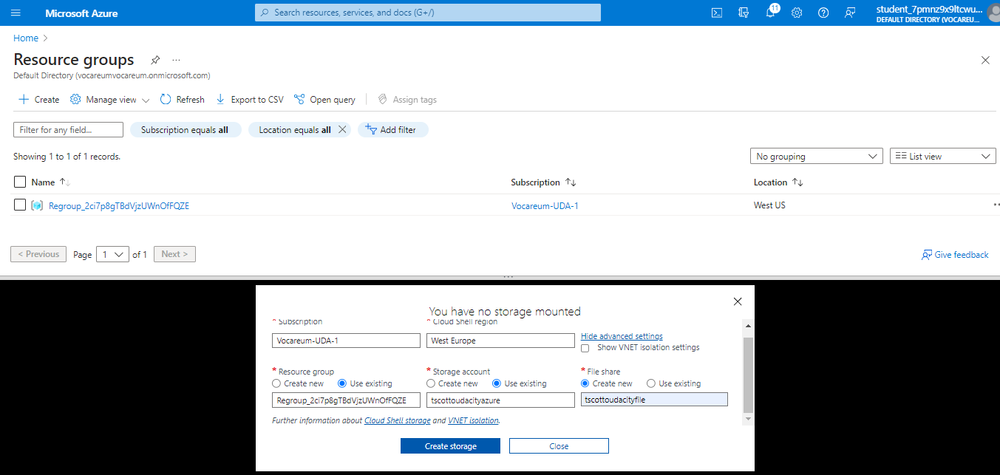

- Run the following in CloudShell:

```
git clone https://github.com/udacity/azure-api-management
```

- Navigate to the project starter folder cd azure-api-management/starter

- Make the script executable

```
chmod +x setup.sh
```

- Run ./setup.sh (I had to switch from powershell to bash to run this)

```
./setup.sh
```

The script will output a URL of the weather app. This is our backend of our API. Copy this URL. It will look something like this https://WeatherDataAPId72d5e4a32.azurewebsites.net/swagger/v1/swagger.json(opens in a new tab) If you loose your URL you can find it by searching the Azure portal for "weatherdataapi" selecting the web app and copying the URL. Do not forget to append

## Creatig API service

Screenshots and steps

1.  Create an API instance via PowerShell
    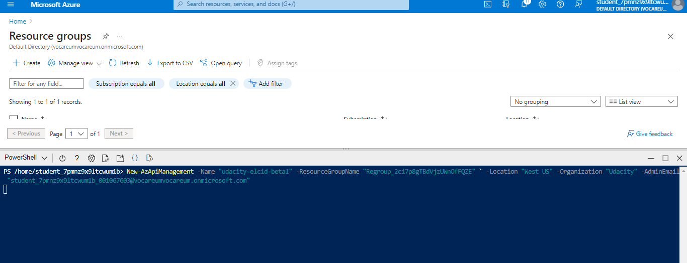
    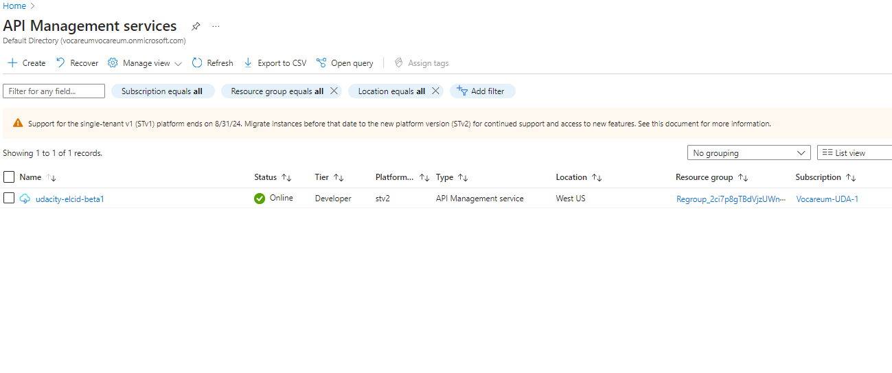

2.  Import the weather API into API management using the OpenAPI standard

    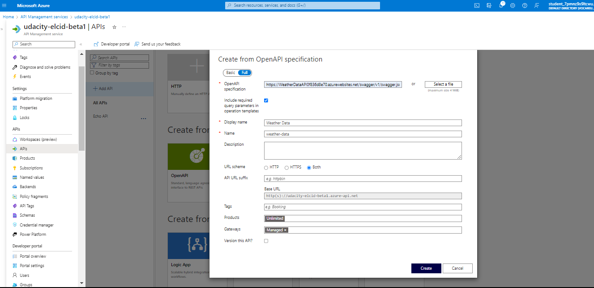

3.  GET operation on the API ( GetTodaysWeather ). Using 1 and 1 for the latitude and longitude.
    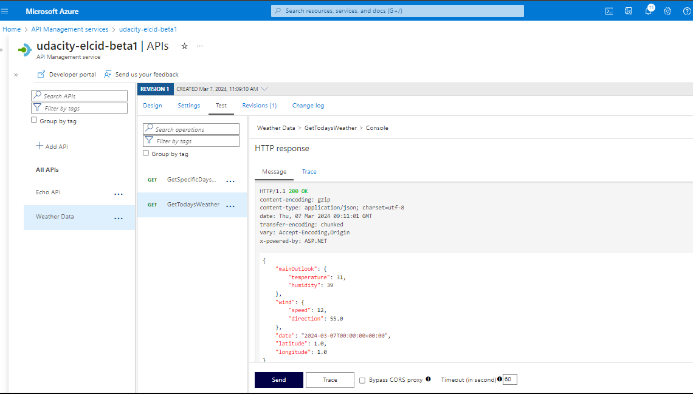

4.  Applying policies that throttles traffic to the API to 3 calls every 50 seconds AND strips the following header from the API for ALL operations.

    - X-Powered-By
      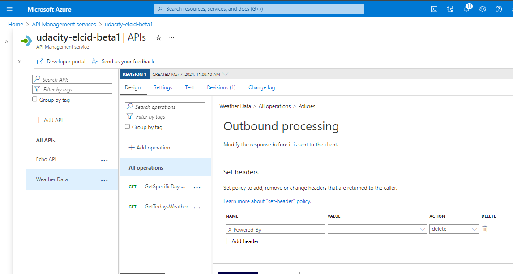 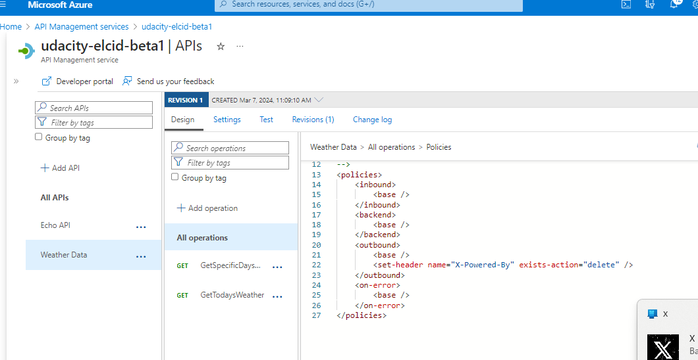
    - Perform a test on any operation and show that the header has been removed from the response
      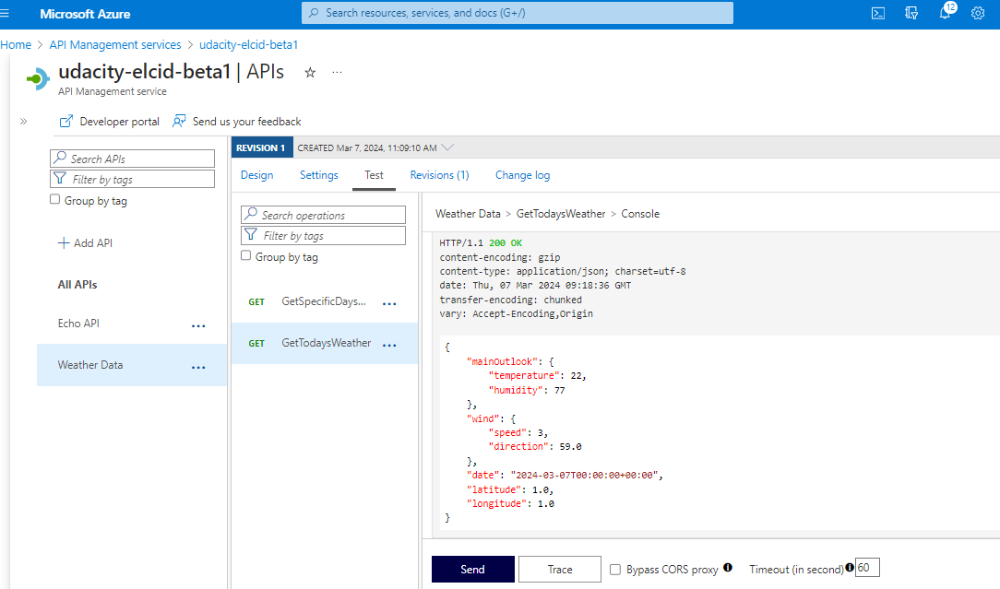
    - Use context.Subscription.Id as the counter key for throttling
      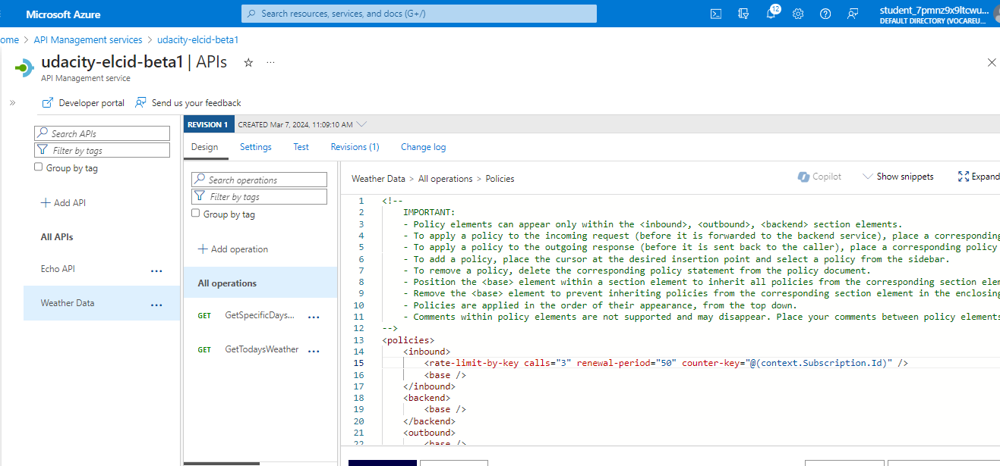
    - Perform a test to prove the throttling is working by performing 4 test operations quickly on any API endpoint
      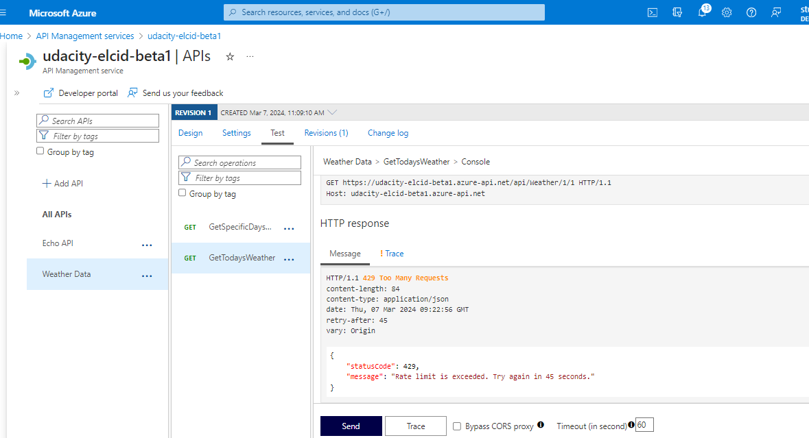

5.  Applying subscription authentication by assigning the API to a product called Udacity
    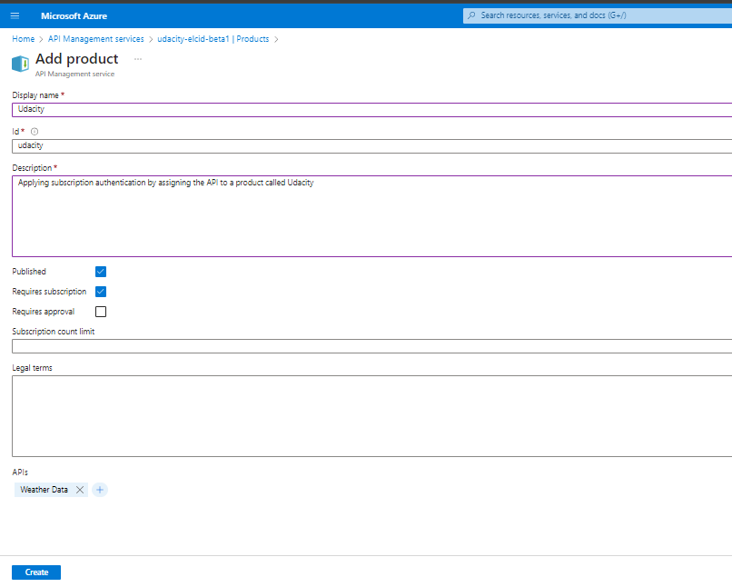
    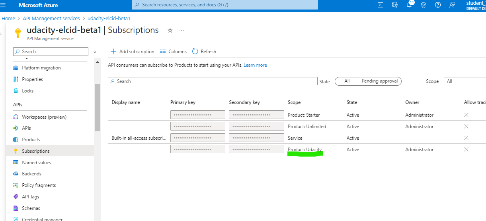

    - Perform the following curl test (change the URL to reflect your API) to prove the subscription authentication is working:

    ```bash
    curl -X GET https://udacity-elcid-beta1.azure-api.net/api/Weather/1/1

    curl -X GET https://udacity-elcid-beta1.azure-api.net/api/Weather/1/1 -H 'Ocp-Apim-Subscription-Key: <subscrition key>'
    ```

    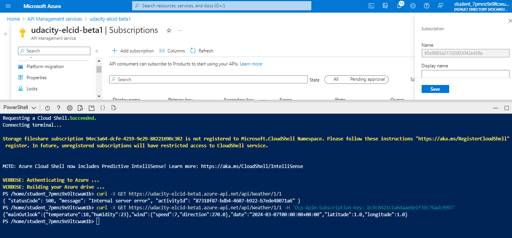

6.  Create an email alert when there are over 10 4xx alerts within a 1 minute period
    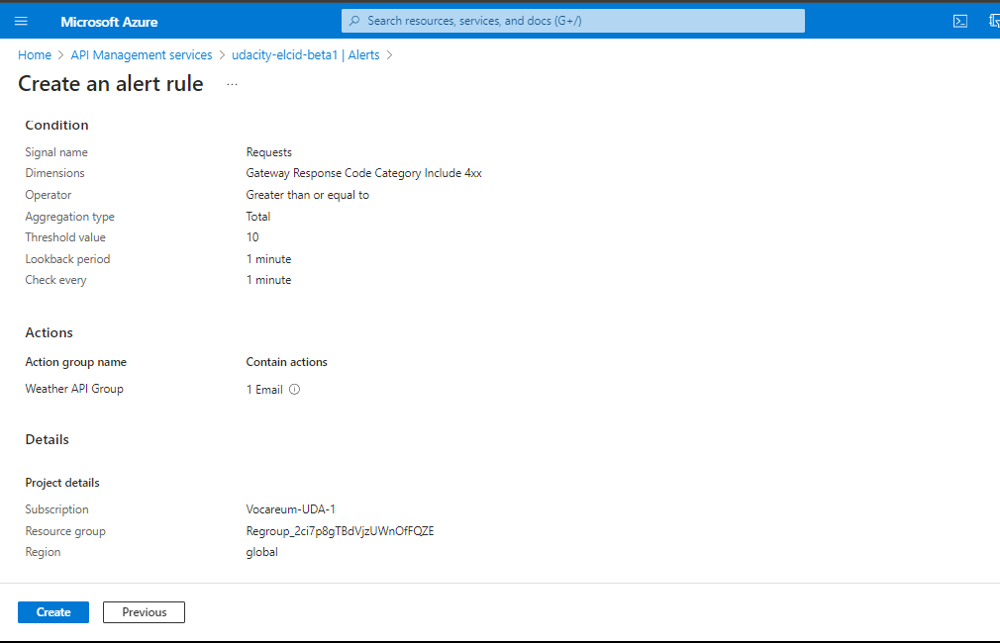

        - Test this alert by accessing an invalid path to your API 10 times in a row (generating a 404) and seeing the alert fire

        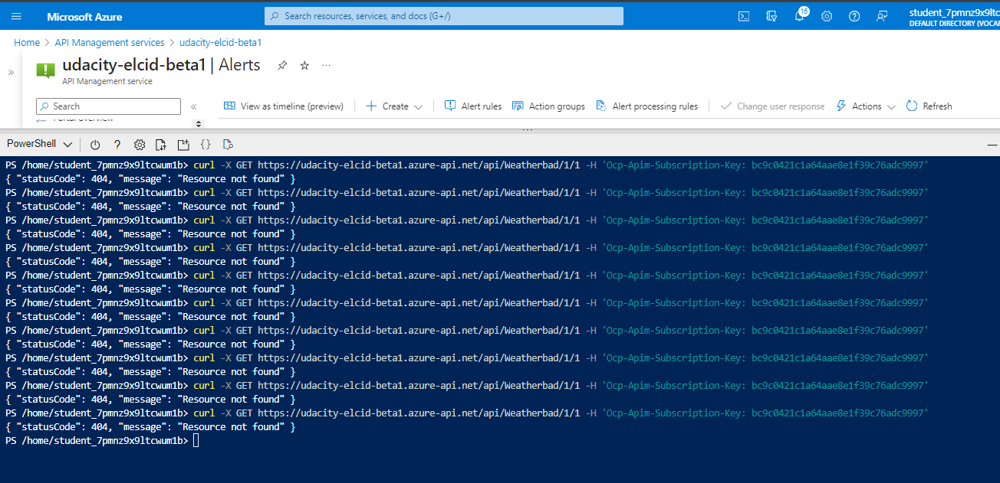

        - alert fired
            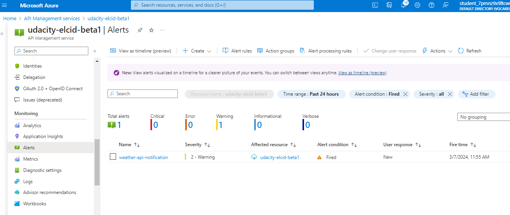
            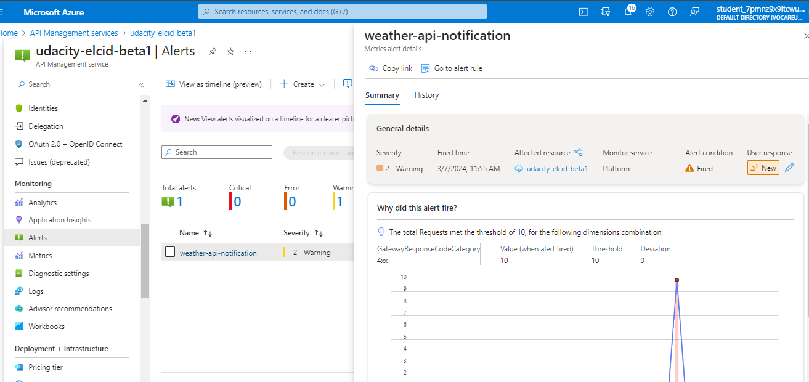
        - Email notification
        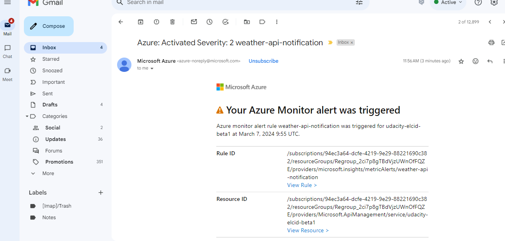
        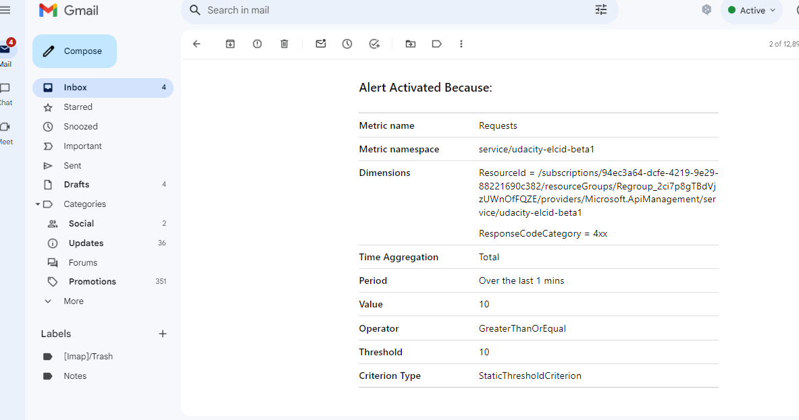

Closing all instaces after completion
